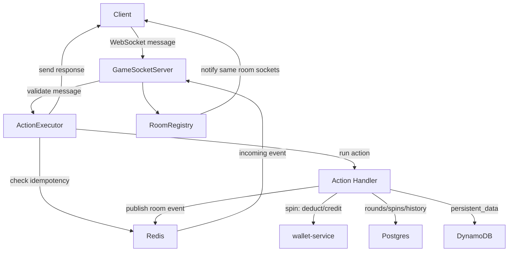
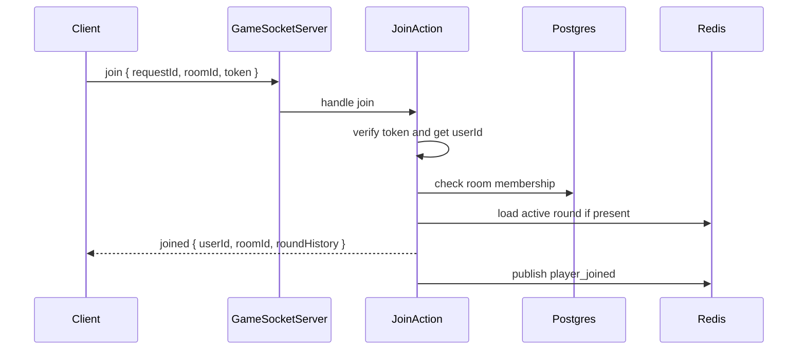
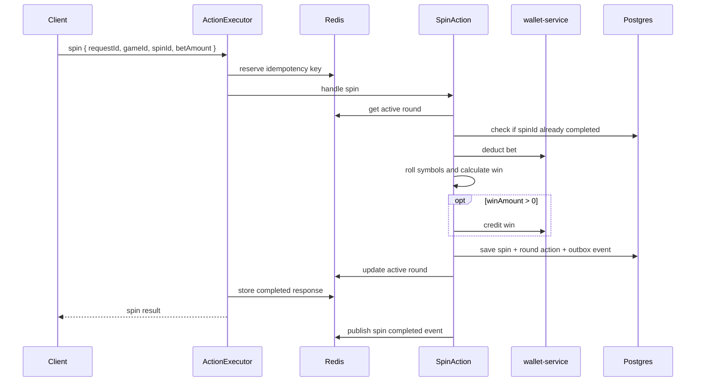
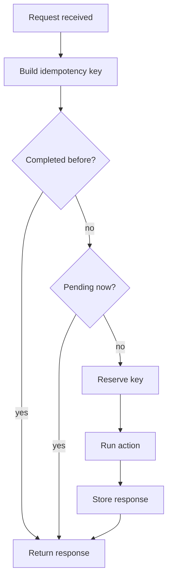
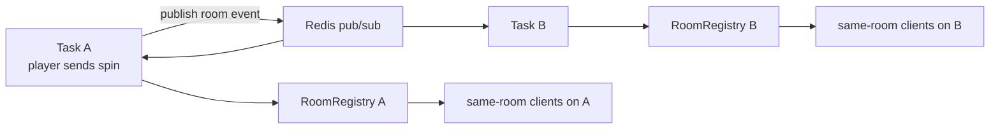

# Game Service Flow

This is the core flow of `game-service`.

## Main Flow



## Join



After join succeeds:

- `ws.userId` is set.
- `ws.roomId` is set.
- The socket is mapped into `RoomRegistry`.

## Spin



## Idempotency



## Realtime Room Notification



Each game-service task only notifies the WebSocket connections it owns.

## Storage

```text
Redis
  idempotency keys
  active round cache
  pub/sub room events

Postgres
  room membership
  completed spins
  round action history
  outbox events

DynamoDB
  flexible player/game persistent data
```

